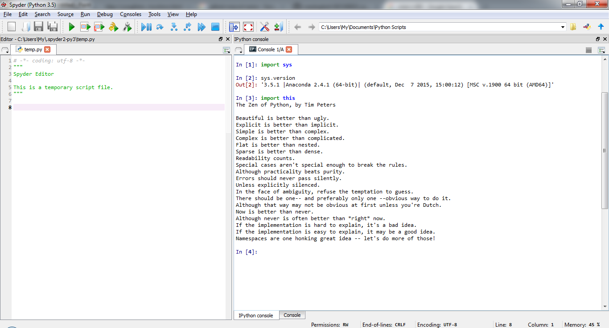

UECM3033 Assignment #1 Report
========================================================

- Prepared by: Kok Wen Jing
- Tutorial Group: T2

--------------------------------------------------------

## Task 1 -- setup a github repository

The reports, codes and supporting documents are uploaded to Github at: 

[https://github.com/wenjingkok/UECM3033_assign1](https://github.com/wenjingkok/UECM3033_assign1)

---------------------------------------------------------

## Task 2 -- setup python

Put here the screen shot of file (python.png)

------------------------------------------------------------

## Task 3 -- modify and run Python script

In this section, please report:

1. The hexadecimal value of your student ID.

   Hexadecimal representation of 1203036 is 0x125b5c

2. Write down the definite integrals that you have chosen.

   $$\int_0^{\infty} {x^4}e^{-\frac{x^2}{2}} dx = \frac{3\sqrt{2\pi}}{2}.$$

3. Write down your system of 10 linear equations.

	\begin{align*}
	3 x_0 + x_1 + 4 x_2 + 5 x_3 - 3 x_4 + 2 x_5 + 7 x_6 - 10 x_7 + x_8 + 2 x_9 &= 23,\\
	x_0 + 2 x_1 - 4 x_2 + 9 x_3 - x_4 + x_5 + 3 x_6 + 2 x_7 - 5 x_8 + x_9 &= -4,\\
	4 x_0 + 5 x_1 + 3 x_2 + 2 x_3 + 11 x_4 + 5 x_5 - 6 x_6 + x_7 + 3 x_8 - 8 x_9 &= 2,\\
	2 x_0 - 3 x_1 + 3 x_2 + 4 x_3 + x_4 - 5 x_5 - 4 x_6 + 8 x_7 + x_8 + 2 x_9 &= 25,\\
	-3 x_0 + 2 x_1 + x_2 - x_3 + 6 x_4 + 8 x_5 + 5 x_6 + 5 x_7 + x_8 + 3 x_9 &= 10,\\
	x_0 - x_1 - 7 x_2 + 12 x_3 + 2 x_4 + 3 x_5 + 6 x_6 - 4 x_7 + 4 x_8 + 2 x_9 &= 27,\\
	3 x_0 - 4 x_1 - 2 x_2 - 3 x_3 + 5 x_4 + 13 x_5 + 2 x_6 + 7 x_7 + x_8 + x_9 &= 22,\\
	7 x_0 + 12 x_1 + 8 x_2 + 6 x_3 - 2 x_4 + x_5 - 3 x_6 + 3 x_7 + x_8 + 4 x_9 &= 26,\\
	-4 x_0 + 9 x_1 + x_2 + 2 x_3 + 5 x_4 - x_5 + 2 x_6 + 3 x_7 + 6 x_8 + x_9 &= 15,\\
	8 x_0 + 6 x_1 + 3 x_2 + x_3 - 9 x_4 + 3 x_5 - 2 x_6 + 4 x_7 - 5 x_8 - 2 x_9 &= -11.
	\end{align*}

-----------------------------------

last modified: 28 January 2016
